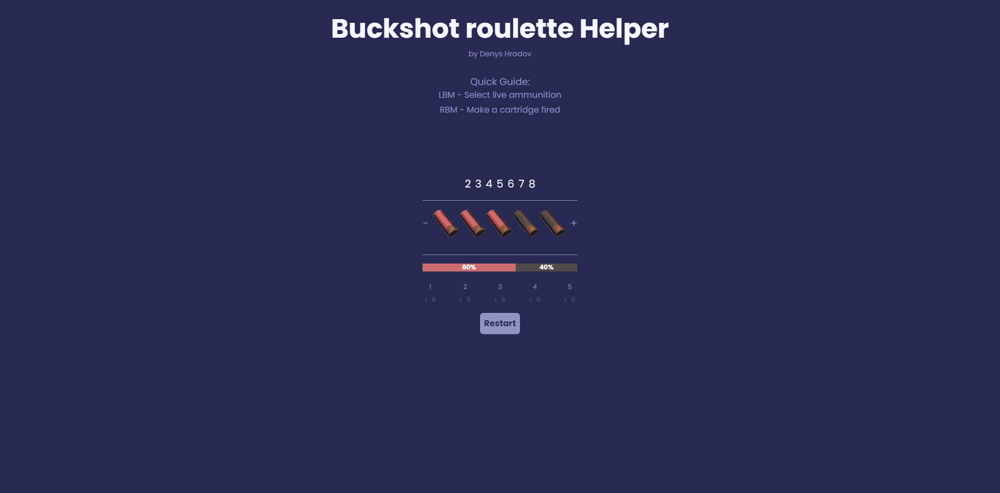
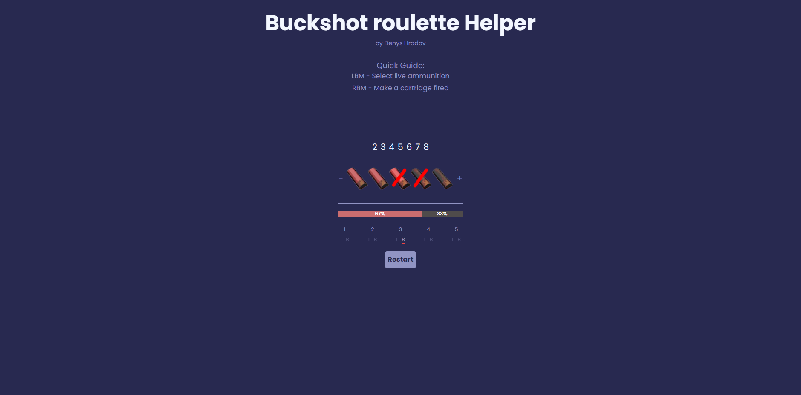

<a name="beginning"></a>

# Website for help to play in Dota 2

### Hi, I'm Denis, and I developed my own website Buckshot Roulette helper

### During development, I used React

### You can watch [short video review](https://youtu.be/QgPA9eWQGKA), or you can read this post




## Functionality:

### This helper allows players to manage and visualize ammunition states for a Russian roulette-style game. Players can:

- Set the number of cartridges by clicking on numbers above the cartridge icons.
- Toggle a cartridge type (live or blank) by left-clicking on an icon.
- Mark a cartridge as "fired" (blank_f or live_f) by right-clicking; clicking again reverts it.
- Track ammunition types with live and blank percentages displayed above a status bar.
- Identify cartridges by position below the icons, where both L (live) and B (blank) indicators are slightly transparent. Selecting one indicator highlights it with full opacity and an underline, locking that type until the indicator is clicked again.
- Reset all cartridges to blank by clicking "Restart" at the bottom.

## Run site
### To run the site, you need to install the dependencies, for this you need to run the command
```
npm install
npm run dev
```